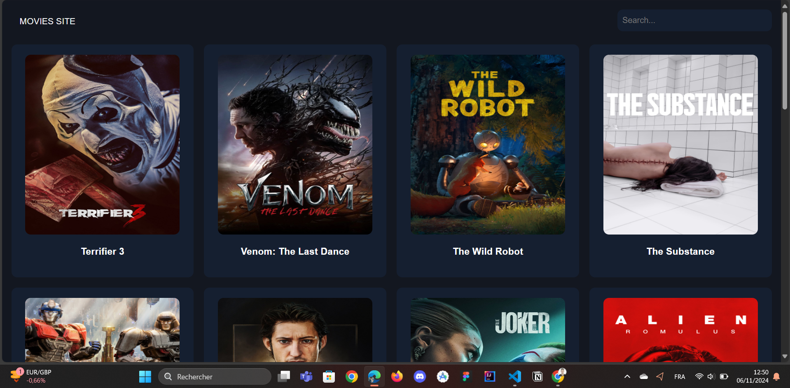

# Movie Database Project

## Overview

This project is a simple web application that interacts with the Movie Database API to fetch and display movies. The application displays movie posters and titles on cards and includes a search functionality to search for movies.

## Features

- Fetch and display popular movies from the Movie Database API.
- Display movie posters and titles on cards.
- Search functionality to find movies by title.

## Technologies Used

- HTML
- CSS
- JavaScript
- [The Movie Database API](https://www.themoviedb.org/documentation/api)

## Setup

1. Clone the repository:
   ```bash
     git clone https://github.com/IDIR2626/Movie_website.git
   ```

## Demo

Here is a video demo of the website:

[](https://youtu.be/eez4WhCnFrw)
